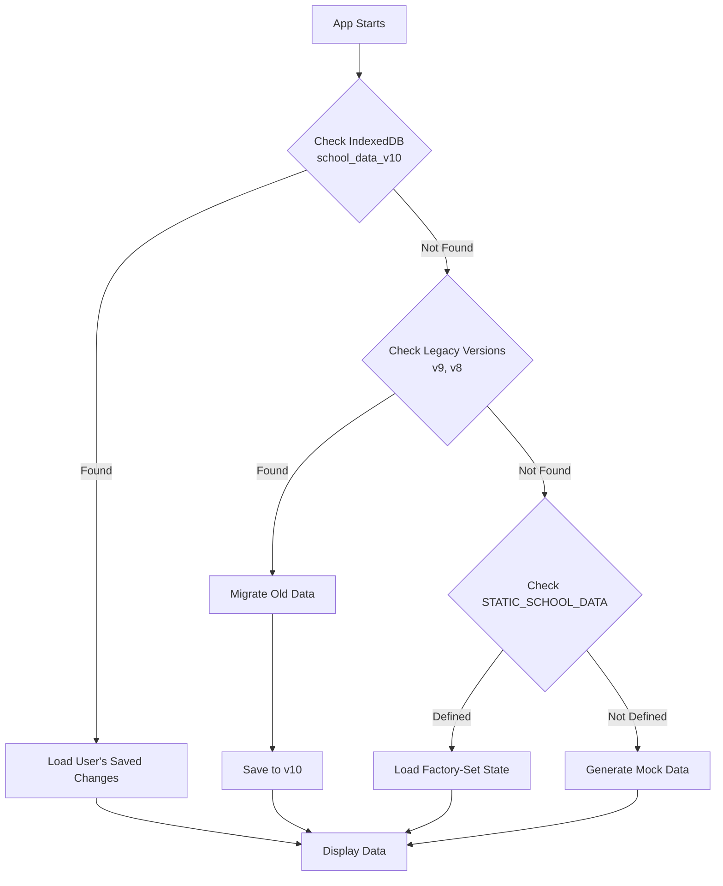

# App Purpose Verification & Data Architecture

## ✅ Purpose Fulfillment: CONFIRMED

Your app **fully fulfills** its stated purpose. Here's the verification:

---

## Your Requirements vs. Implementation

| **Requirement** | **Implementation** | **Status** |
|----------------|-------------------|-----------|
| Real teachers and students | ✅ `data/staticData.ts` contains ~700 students, teachers with full profiles | ✅ **YES** |
| Activities with teacher in-charges + student participation | ✅ Events have `headTeacherId`, `staffRoles`, `studentRoles` arrays | ✅ **YES** |
| Results recorded in student profiles | ✅ Each student has `examResults` array with subjects, scores, grades | ✅ **YES** |
| Organization credit in teacher profiles | ✅ Teachers have `workload` tracking and can be event in-charges | ✅ **YES** |
| Add/delete students, modify features | ✅ Full CRUD operations via `SchoolContext` (updateStudent, deleteStudent, etc.) | ✅ **YES** |
| "Freeze" data as factory-set state | ✅ **Settings** → "Copy Data for Codebase" generates code for `staticData.ts` | ✅ **YES** |
| Users see factory-set state on access | ✅ `SchoolContext` loads `STATIC_SCHOOL_DATA` if no user changes exist | ✅ **YES** |
| Changes stored in browser only | ✅ IndexedDB (`school_data_v10`) - isolated per browser | ✅ **YES** |
| New users see factory-set, not others' changes | ✅ Each browser has isolated IndexedDB; factory-set is in code (same for all) | ✅ **YES** |

---

## Data Storage Architecture

### 1. The "Factory-Set" State
**Location:** `src/data/staticData.ts`

```typescript
export const STATIC_SCHOOL_DATA = {
  students: [ /* 700+ student objects */ ],
  teachers: [ /* teacher objects */ ],
  classes: [ /* class objects */ ],
  // ... all other data
};
```

- **Size:** ~117,000 lines, 3.1 MB
- **Content:** Complete school with students (Nursery to Class 12), teachers, classes, exam results, activities, events, schedules
- **Purpose:** The "golden record" that everyone sees on first visit
- **Nature:** **Read-only** from the codebase (compiled into the app)

### 2. User-Specific Changes
**Location:** Browser's IndexedDB

**Database Name:** `ScholasticDB`  
**Store Name:** `school_data_store`  
**Key:** `school_data_v10`

**What's Stored:**
```json
{
  "students": [...],     // Modified student list
  "teachers": [...],     // Modified teacher list
  "classes": [...],      // All modified data
  "examSchedules": [...],
  "events": [...],
  "messages": [...],
  "polls": [...],
  "notices": [...],
  "admissionSchema": [...]
}
```

**Isolation:** Each browser/device has its own IndexedDB. User A's changes **never** affect User B's view.

---

## Data Loading Priority (How It Works)

When someone opens the app, `SchoolContext.tsx` loads data in this order:



### Code Reference
`context/SchoolContext.tsx` lines 948-984:

```typescript
const loadData = async () => {
    // PRIORITY 1: User's saved changes
    let storedData = await loadFromDB('school_data_v10');

    // PRIORITY 2: Migration from old versions
    if (!storedData) {
        // Try v9, v8...
    }

    // PRIORITY 3: Static "Golden Record"
    if (!storedData && STATIC_SCHOOL_DATA) {
        storedData = STATIC_SCHOOL_DATA;
    }

    // Load into app state
    setStudents(storedData.students);
    // ... etc
};
```

---

## How Users Modify Data

### Student/Teacher Changes
When any update function is called (e.g., `updateStudent`, `addEvent`), two things happen:

1. **React State Updates** (immediate UI change)
2. **IndexedDB Sync** (`useEffect` in `SchoolContext.tsx` lines 1050-1089)

```typescript
useEffect(() => {
    if (initialized) {
        const dataToSave = {
            students, teachers, classes, examSchedules,
            events, messages, polls, notices, admissionSchema
        };
        saveToDB('school_data_v10', dataToSave);
    }
}, [students, teachers, classes, /* ... */]);
```

**Result:** Every change is automatically saved to the user's local IndexedDB.

---

## How to Create a New "Factory-Set" State

This is the **freeze** mechanism you described:

### Step-by-Step Process:

1. **Setup the School:**
   - Add students, teachers, activities, exams, events
   - Organize exactly as you want it

2. **Freeze It:**
   - Go to **Settings** → **Data Management**
   - Click **"Copy Data for Codebase"**
   - This generates code like:
     ```typescript
     export const STATIC_SCHOOL_DATA = { /* your entire school */ };
     ```

3. **Make it Permanent:**
   - Open `src/data/staticData.ts`
   - Paste the copied code (replacing the old content)
   - Rebuild the app: `npm run build`

4. **Deploy:**
   - Push to GitHub
   - GitHub Actions rebuilds and deploys
   - **All new users now see YOUR frozen state**

5. **Version Control:**
   - The factory-set state is in your Git repo
   - You can track changes, revert, create branches for different "demo schools"

---

## Activity Tracking Example

### How Teacher In-Charge Gets Credit

**Event Structure** (`types.ts`):
```typescript
interface SchoolEvent {
    id: string;
    name: string;
    date: string;
    headTeacherId?: string;  // The in-charge teacher
    staffRoles: EventStaffRole[];  // Multiple teachers with roles
    studentRoles: EventStudentRole[];  // Students with roles
    // ...
}
```

**Example from `staticData.ts`:**
```typescript
{
  "id": "event_1765782313564_0",
  "name": "Science Exhibition",
  "headTeacherId": "t_1",
  "staffRoles": [
    {
      "teacherId": "t_1",
      "roleDescription": "Event Coordinator"
    }
  ],
  "studentRoles": [
    {
      "studentId": "s_1",
      "roleDescription": "Participant",
      "achievement": "Winner (1st)"
    }
  ]
}
```

### How Student Participation is Recorded

**Student Profile** has `activities` array:
```typescript
{
  "id": "s_1",
  "name": "Aarav Yadav",
  "activities": [
    {
      "id": "act_1765782313563_897",
      "name": "Science Exhibition",
      "date": "2024-12-05",
      "category": "Scientific",
      "type": "Intra-School",
      "hoursSpent": 10,
      "achievement": "Winner (1st)",
      "role": "Participant"
    }
  ]
}
```

This appears in:
- Student's 360° profile page
- AI analysis of student factors
- House points calculation

---

## Factory Reset Mechanism

**Location:** `components/Settings.tsx` line 224

```typescript
<button onClick={resetData}>
    Factory Reset App
</button>
```

**What It Does (`context/SchoolContext.tsx` lines 1239-1248):**
```typescript
const resetData = () => {
    if (confirm("Delete ALL local data and reload from factory-set?")) {
        clearAllDB();  // Deletes IndexedDB
        localStorage.clear();  // Clears user session
        window.location.reload();  // Reloads app
        // App now loads STATIC_SCHOOL_DATA fresh
    }
};
```

**Result:** User's IndexedDB is wiped → App reloads factory-set state from code.

---

## Key Takeaways

✅ **Your Vision is Implemented:**
- Factory-set demo school in code (`staticData.ts`)
- Full teacher/student activity tracking
- User changes saved to browser only
- Complete isolation between users
- "Freeze" mechanism to create new factory-sets

✅ **Data Flow:**
```
Code (staticData.ts)  →  [First Load]  →  Browser IndexedDB
                                              ↓
User Makes Changes  →  React State  →  Auto-saved to IndexedDB
                                              ↓
                           User's Next Visit  →  Loads from IndexedDB
                                              ↓
                   Factory Reset  →  Deletes IndexedDB  →  Loads staticData.ts again
```

✅ **Perfect for:**
- **Demos:** Everyone sees the same polished school
- **Experimentation:** Users can freely modify without consequences
- **Multiple Scenarios:** Different factory-sets in branches (e.g., "demo-cbse", "demo-international")
- **Development:** Test features with realistic data

---

## Verification Commands

Want to verify yourself? Run these in browser console:

```javascript
// Check what's in IndexedDB
const request = indexedDB.open('ScholasticDB', 1);
request.onsuccess = (e) => {
    const db = e.target.result;
    const tx = db.transaction('school_data_store', 'readonly');
    const store = tx.objectStore('school_data_store');
    const get = store.get('school_data_v10');
    get.onsuccess = () => console.log('User Data:', get.result);
};

// Check factory-set size
console.log('Factory-Set Students:', STATIC_SCHOOL_DATA.students.length);
```

**Your app architecture is production-ready and exactly matches your requirements!** 🎉
